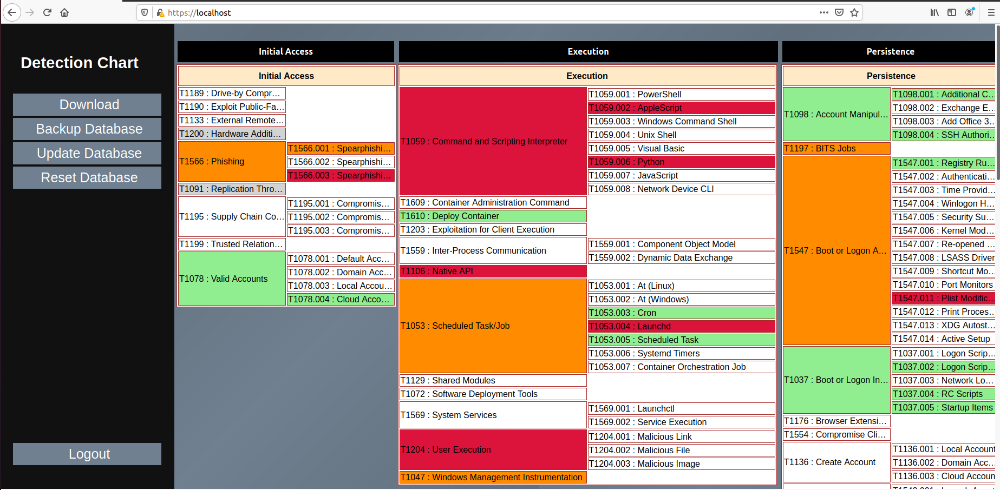

# DetectionNavigator

This tool quickly helps build detection chart ( a.k.a. detection heatmap ).

Version 2.0 coming soon 

You can use docker installation option OR import the ova file. You can find more information here in this article : https://desi-jarvis.medium.com/detection-navigator-a97ffd4fbeff

**DOCKER SETUP**

$ wget https://github.com/madhavbhatt/DetectionNavigator/raw/master/detectionnavigator-docker.zip

$ unzip detectionnavigator-docker.zip

$ cd dockerdetectionnavigator

$ docker-compose up -d

$ docker exec -it <containerID> /root/config-db-django.sh

**VIRTUAL MACHINE SETUP**

Credentials for Detection Navigator VM

username : detectionnav

password : detectionnavpassword1!

It works with VirtualBox. You may have to change some of the settings for the VM.

For example , if you get a network interface error , that might be because your network interface is named differently. Change the network settings to your preference. Change USB setting from USB 2.0 to USB 1.1/1.0 if you see a USB 2.0 error.

 
